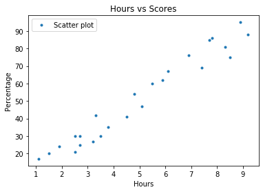
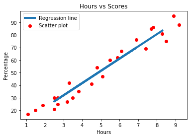

# Linear Regression 

Linear Regression is a machine learning algorithm based on supervised learning. It performs a regression task. Regression models a target prediction value based on independent variables. It is mostly used for finding out the relationship between variables and forecasting. Linear regression performs the task to predict a dependent variable value (y) based on a given independent variable (x). So, this regression technique finds out a linear relationship between x (input) and y(output). Hence, the name is Linear Regression.
 
## Regression Mechanics:

    Y = ax+b
       y = Target
       x = Singlefeature
       a,b = Parameters of model
       
       
## Problem :
   
   In this regression task we will predict the percentage of marks that a student is expected to score based upon the number of hours they studied.
   
## Dataset:
  
   Data can be found at :  http://bit.ly/w-data
The dataset conatains two columns and 25 rows it contains the number of hours and scores of 25 people

## Import necessary libraries
  
 import numpy as np
 import pandas as pd
 import matplotlib.pyplot as plt
 
## Visual Exploratory Data
 
  
  
## Preparing the data
 
 Independent variable or input variable = Feature variable = x
 Dependent variable or output variable = Target variable = y
 
## Split the datset

 Split the data into training and test datasets, we'll do this by using Scikit-Learn's built-in train_test_split() method
 The model learn the relationships from the training data and predict on the test data
 
## Traning the Algorithm

 I have split the data into training and testing sets, and now i ll train the algorithm using LinearRegressor method,then instaniate the regressor and fit it on the traning set   using the fit() method
 In this step the model learned the relationships between the training data ie,x_train and y_train.Now the model is ready to make predictionson the test data using the   
 predict() method
 
## Predict the data
 
 Now that we have trained our algorithm, it's time to make some predictions.
 
    y_pred = linear_reg.predict(x_test)
    df_pred = pd.DataFrame(y_pred, index=x_test.index, columns=['y_pred'])
    
           y_pred
     8   83.391686
     16  27.070549
     0   27.070549
     23  69.796929
     11  60.086388
     9   29.012657
     13  34.838982
     1   52.317955
     
## Regression metrics for model performance
  The final step is to evaluate the performance of algorithm. This step is particularly important to compare how well different algorithms perform on a particular dataset.For     Regression problems,there are MAE[Mean Absolute Error],RMSE[Root Mean Square Error],R2[R-squared value].For instance here, we have chosen the mean square error
  
  Mean Absolute Error: 4.499999999999998
  Root Mean Squared Error: 4.859985351228103
  Mean squared Error: 23.61945761415174
 
## Plot the Regression line

  
## Conclusion
  The model we have built can be used for inference of how the different predictors influence the outcome.It helps by providing good estimations of the significant relations     between the predictors and the outcome. These estimations can be used to summarize the data in a more useful and presentful way.
  According to the problem statement we can say that if a person studies for 9.25 hours the predicted score would 92 marks.

